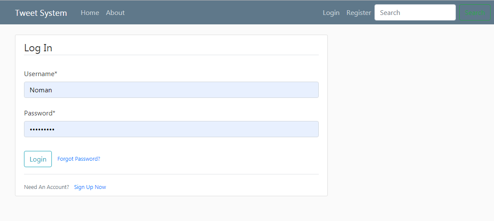

# TweetBlog
Post upload see tweets 

*This is website made using famous framework DJANGO* 

Home page of website:

  
  
as you can see it contains navigation bar so when click on login, login page will appear
login page:

  
  
  
In the Home page we can also see registration tab click on it we will go to registartion page 

registration page :
    
    
 there is a register button down on registration page which is not visible in above photograph
 
when you login you will be going to home page but there is a certain difference 

home page after Login:
    
    
Now the contains of navigation bar is changed 

when you click on profile you will see your profile page

profile page:
    
    
you can change anything on profile page down there is a button Update which is not visible in above photograph,
which simply updates your profile

in navigation there is newpost tab click on it 

new post page:
    
 when you click on logout 
 logout page:
    
